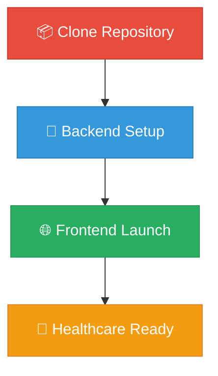

```
╔══════════════════════════════════════════════════════════════════════════════╗
║                          🩺 HEALTHCARE NEXUS 🩺                             ║
║                     ━━━━━━━━━━━━━━━━━━━━━━━━━━━━━━━━━━━━━━                      ║
║                        Next-Gen Medical Ecosystem                           ║
╚══════════════════════════════════════════════════════════════════════════════╝
```

<div align="center">

</div>

---

## 🔬 **MEDICAL INTELLIGENCE MATRIX**

```ascii
    ┌─────────────────────────────────────────────────────────────┐
    │  🏥 PATIENT CARE    │  👨‍⚕️ CLINICAL OPS   │  ⚙️ ADMIN CONTROL  │
    ├─────────────────────┼─────────────────────┼─────────────────────┤
    │  • Health Records   │  • Diagnosis Tools  │  • System Analytics │
    │  • Appointments     │  • Treatment Plans  │  • User Management  │
    │  • Telemedicine     │  • Prescriptions    │  • Compliance       │
    │  • Billing          │  • Patient Tracking │  • Reports          │
    └─────────────────────┴─────────────────────┴─────────────────────┘
```

---

## 📸 **PORTAL SHOWCASE**

<details>
<summary>🏥 <strong>PATIENT EXPERIENCE CENTER</strong></summary>
<br>

<blockquote>
<em>"Your health journey, digitally transformed"</em>
</blockquote>
</details>

<details>
<summary>👨‍⚕️ <strong>PHYSICIAN COMMAND HUB</strong></summary>
<br>

<blockquote>
<em>"Clinical excellence meets digital innovation"</em>
</blockquote>
</details>

<details>
<summary>⚙️ <strong>ADMINISTRATIVE NERVE CENTER</strong></summary>
<br>

<blockquote>
<em>"Total healthcare ecosystem control"</em>
</blockquote>
</details>

---

## ⚡ **TECH DNA**

<table>
<tr>
<td width="50%">

**🎯 FRONTEND ARSENAL**
```yaml
React.js: ████████████ 100%
CSS3: ████████████ 100%
Bootstrap: ████████████ 100%
```

</td>
<td width="50%">

**🔧 BACKEND POWERHOUSE**
```yaml
Node.js: ████████████ 100%
Express.js: ████████████ 100%
MongoDB: ████████████ 100%
```

</td>
</tr>
</table>

---

## 🚀 **DEPLOYMENT PROTOCOL**

<div align="center">



</div>

### 🔧 **Backend Initialization**
```bash
# Navigate to backend
cd backend && npm install

# Environment Configuration
echo "MONGODB_URI=mongodb://localhost:27017/healthcare_db
JWT_SECRET=your_jwt_secret
STRIPE_SECRET_KEY=your_stripe_secret_key" > .env

# Launch Medical Server
npm run dev
```

### 🌐 **Frontend Activation**
```bash
# Navigate to frontend
cd frontend && npm install

# Environment Setup
echo "VITE_API_URL=http://localhost:5000/api
VITE_SOCKET_URL=http://localhost:5000" > .env

# Deploy Healthcare Interface
npm run dev
```

---

## 🏥 **MEDICAL HIERARCHY**

<div align="center">

| Role | Access Level | Capabilities |
|------|-------------|-------------|
| 🏥 **Patient** | `Level 1` | Medical Records, Appointments, Messaging |
| 👨‍⚕️ **Doctor** | `Level 2` | Patient Management, Prescriptions, Consultations |
| ⚙️ **Admin** | `Level 3` | System Control, Analytics, User Management |

</div>

---

## 🔐 **SECURITY FORTRESS**

```
┌─────────────────────────────────────────────────────────────┐
│                    🛡️ PROTECTION LAYERS                     │
├─────────────────────────────────────────────────────────────┤
│  JWT Authentication     ████████████████████████ 100%      │
│  HIPAA Compliance      ████████████████████████ 100%      │
│  Data Encryption       ████████████████████████ 100%      │
│  Payment Security      ████████████████████████ 100%      │
│  Role-Based Access     ████████████████████████ 100%      │
└─────────────────────────────────────────────────────────────┘
```

---

## 📊 **DATA ARCHITECTURE**

<details>
<summary><strong>🗄️ Database Blueprints</strong></summary>

```javascript
// User Entity Schema
const HealthcareUser = {
  name: String,
  email: String,
  password: String,
  role: ['patient', 'doctor', 'admin'],
  profileImage: String,
  specialization: String,
  consultationFee: Number
}

// Appointment Entity Schema
const MedicalAppointment = {
  patient: ObjectId,
  doctor: ObjectId,
  date: Date,
  time: String,
  status: ['scheduled', 'completed', 'cancelled'],
  consultationFee: Number,
  paymentStatus: String
}
```

</details>

---

## 🌐 **ACCESS MATRIX**

<div align="center">

```
🏥 Patient Portal ────────► http://localhost:5173
👨‍⚕️ Doctor Hub ──────────► http://localhost:5173/doctor
⚙️ Admin Center ─────────► http://localhost:5173/admin
```

</div>

---

<div align="center">

```
╔══════════════════════════════════════════════════════════════╗
║                    🏥 HEALTHCARE NEXUS 🏥                    ║
║              Revolutionizing Medical Technology              ║
║                     Built with ❤️ for Health                ║
╚══════════════════════════════════════════════════════════════╝
```

**⚡ Powered by Innovation | 🔒 Secured by Design | 🏥 Trusted by Healthcare**

</div>
