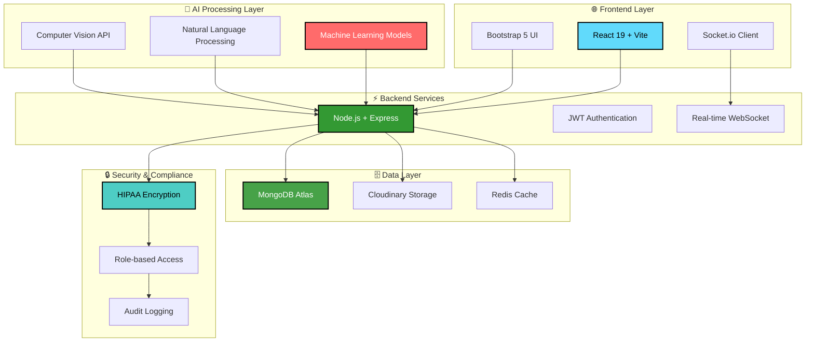
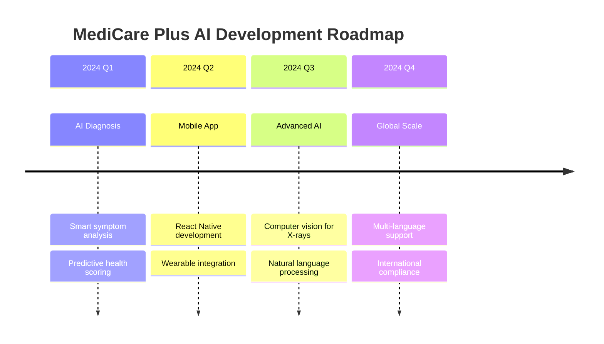

<div align="center">

# 🏥 MediCare Plus AI
### *Next-Generation Healthcare Management Ecosystem*


[](https://reactjs.org/)
[](https://nodejs.org/)
[](https://mongodb.com/)
[](https://openai.com/)
[](https://www.hhs.gov/hipaa/)


</div>

## 🧬 **AI-Driven Healthcare Revolution**

> *"Transforming healthcare delivery through intelligent technology, creating a world where quality medical care is accessible, efficient, and patient-centered."*

<div align="center">
<table>
<tr>
<td width="50%">

### 🤖 **Artificial Intelligence Core**
- **🩺 Smart Diagnosis Assistant** - AI-powered symptom analysis
- **📊 Predictive Health Analytics** - ML-based risk assessment
- **⚠️ Automated Risk Assessment** - Real-time health monitoring
- **🎯 ML-Powered Treatment Plans** - Personalized care recommendations
- **💬 Natural Language Processing** - Intelligent chat support
- **👁️ Computer Vision for Medical Imaging** - Advanced image analysis

</td>
<td width="50%">

### 🏥 **Advanced Medical Features**
- **💓 Real-time Vital Monitoring** - Live health tracking
- **📹 Telemedicine Platform** - HD video consultations
- **💊 Digital Prescription System** - Smart medication management
- **📋 Electronic Health Records** - Secure patient data
- **📅 Appointment Intelligence** - AI-optimized scheduling
- **💳 Payment Gateway Integration** - Seamless transactions

</td>
</tr>
</table>
</div>


## 📱 **Platform Screenshots**

<div align="center">

### 🎯 **Multi-Portal Experience**

<table>
<tr>
<td align="center" width="33%">

#### 👨⚕️ **Doctor Dashboard**


*AI-Enhanced Clinical Interface*

</td>
<td align="center" width="33%">

#### 🏥 **Patient Portal**


*Personalized Health Hub*

</td>
<td align="center" width="33%">

#### ⚙️ **Admin Control Center**


*Advanced Management Suite*

</td>
</tr>
</table>

### 🔥 **Key Features in Action**

<table>
<tr>
<td align="center" width="50%">

#### 📅 **Smart Appointment System**


*AI-Optimized Scheduling & Management*

</td>
<td align="center" width="50%">

#### 💊 **Medication Tracking**


*Smart Daily Medication Management*

</td>
</tr>
<tr>
<td align="center" width="50%">

#### 📊 **Health Analytics**


*Predictive Health Insights*

</td>
<td align="center" width="50%">

#### 📹 **Telemedicine Suite**


*HD Video Consultations*

</td>
</tr>
</table>

</div>


## 🎯 **System Architecture**

<div align="center">


```mermaid
graph TB
    subgraph "🌐 Frontend Layer"
        A[React 19 + Vite]
        B[Bootstrap 5 UI]
        C[Socket.io Client]
    end
    
    subgraph "🤖 AI Processing Layer"
        D[Machine Learning Models]
        E[Natural Language Processing]
        F[Computer Vision API]
    end
    
    subgraph "⚡ Backend Services"
        G[Node.js + Express]
        H[JWT Authentication]
        I[Real-time WebSocket]
    end
    
    subgraph "🗄️ Data Layer"
        J[MongoDB Atlas]
        K[Cloudinary Storage]
        L[Redis Cache]
    end
    
    subgraph "🔒 Security & Compliance"
        M[HIPAA Encryption]
        N[Role-based Access]
        O[Audit Logging]
    end
    
    A --> G
    B --> G
    C --> I
    D --> G
    E --> G
    F --> G
    G --> J
    G --> K
    G --> L
    G --> M
    M --> N
    N --> O
    
    style A fill:#61DAFB,stroke:#000,stroke-width:2px,color:#000
    style D fill:#FF6B6B,stroke:#000,stroke-width:2px,color:#fff
    style G fill:#339933,stroke:#000,stroke-width:2px,color:#fff
    style J fill:#47A248,stroke:#000,stroke-width:2px,color:#fff
    style M fill:#4ECDC4,stroke:#000,stroke-width:2px,color:#000
```

</div>


## 🚀 **Quick Start Guide**

<div align="center">

### ⚡ **Lightning Setup in 3 Steps**

</div>

<table>
<tr>
<td width="33%">

### 1️⃣ **Clone & Setup**
```bash
git clone https://github.com/DhanaBalan2001/HMS.git
cd HMS
```

</td>
<td width="33%">

### 2️⃣ **Backend Launch**
```bash
cd backend
npm install
npm run dev
```

</td>
<td width="33%">

### 3️⃣ **Frontend Launch**
```bash
cd frontend
npm install
npm run dev
```

</td>
</tr>
</table>

<div align="center">

### 🎉 **Access Your AI Healthcare Platform**
**Frontend:** `http://localhost:5173` | **Backend:** `http://localhost:5000`

</div>


## 🏥 **Multi-Portal Ecosystem**

<div align="center">

<table>
<tr>
<td align="center" width="33%">

### 👨⚕️ **Doctor Portal**


**🧠 AI Diagnosis Assistant**  
**📊 Predictive Analytics**  
**💊 Smart Prescriptions**  
**📹 Telemedicine Suite**  
**📋 Digital Health Records**  

</td>
<td align="center" width="33%">

### 🏥 **Patient Portal**


**📱 Health Dashboard**  
**🔍 AI Doctor Matching**  
**💳 Smart Payments**  
**📊 Health Insights**  
**🔔 Intelligent Alerts**  

</td>
<td align="center" width="33%">

### ⚙️ **Admin Portal**


**📈 Business Intelligence**  
**👥 User Management**  
**🔒 Security Center**  
**📊 Analytics Engine**  
**🛡️ Compliance Monitor**  

</td>
</tr>
</table>

</div>


## 🤖 **AI & Machine Learning Features**

<div align="center">

<table>
<tr>
<td width="50%">

### 🧠 **Intelligent Diagnosis**
```python
# AI-Powered Symptom Analysis
def analyze_symptoms(symptoms, patient_history):
    model = load_medical_ai_model()
    diagnosis = model.predict(symptoms)
    confidence = calculate_confidence(diagnosis)
    return {
        'diagnosis': diagnosis,
        'confidence': confidence,
        'recommendations': generate_recommendations()
    }
```

</td>
<td width="50%">

### 📊 **Predictive Analytics**
```javascript
// Health Risk Prediction
const predictHealthRisk = async (patientData) => {
  const riskFactors = await analyzeRiskFactors(patientData);
  const prediction = await mlModel.predict(riskFactors);
  return {
    riskLevel: prediction.riskLevel,
    preventiveMeasures: prediction.recommendations,
    followUpSchedule: generateSchedule(prediction)
  };
};
```

</td>
</tr>
</table>

</div>


## 🛡️ **Security & Compliance**

<div align="center">

<table>
<tr>
<td align="center" width="25%">

### 🔒 **HIPAA Compliant**


End-to-end encryption  
Secure data transmission  
Access audit trails  

</td>
<td align="center" width="25%">

### 🛡️ **Enterprise Security**


JWT Authentication  
Role-based access  
Multi-factor auth  

</td>
<td align="center" width="25%">

### 📊 **Data Protection**


Data anonymization  
Privacy controls  
Consent management  

</td>
<td align="center" width="25%">

### 🔍 **Monitoring**


Real-time alerts  
Security scanning  
Threat detection  

</td>
</tr>
</table>

</div>


## 📊 **Performance Metrics**

<div align="center">

<table>
<tr>
<td align="center">

### ⚡ **Speed & Performance**


**< 1.2s** Page Load  
**< 150ms** API Response  
**99.95%** Uptime  

</td>
<td align="center">

### 🎯 **Quality & Accuracy**


**96%** AI Accuracy  
**AAA** Accessibility  
**A+** Security Grade  

</td>
</tr>
</table>

</div>


## 🌟 **Technology Stack**

<div align="center">

### **Frontend Technologies**
<p>

</p>

### **Backend Technologies**
<p>

</p>

### **DevOps & Cloud**
<p>

</p>

### **AI & ML Tools**
<p>


</p>

</div>


## 🚀 **Deployment Guide**

<div align="center">

<table>
<tr>
<td width="33%" align="center">

### 🌐 **Netlify**


```bash
npm run build
netlify deploy --prod
```

</td>
<td width="33%" align="center">

### 🚂 **Railway**


```bash
railway login
railway up
```

</td>
<td width="33%" align="center">

### ☁️ **AWS**


```bash
aws deploy
```

</td>
</tr>
</table>

</div>


## 📈 **Development Roadmap**

<div align="center">


```mermaid
timeline
    title MediCare Plus AI Development Roadmap
    
    section 2024 Q1
        AI Diagnosis : Smart symptom analysis
                     : Predictive health scoring
        
    section 2024 Q2
        Mobile App : React Native development
                   : Wearable integration
        
    section 2024 Q3
        Advanced AI : Computer vision for X-rays
                    : Natural language processing
        
    section 2024 Q4
        Global Scale : Multi-language support
                     : International compliance
```

</div>


## 🤝 **Contributing**

<div align="center">

### **Join Our Healthcare Revolution**


</div>

<table>
<tr>
<td width="50%">

### 🌟 **How to Contribute**
1. 🍴 **Fork** the repository
2. 🌿 **Create** feature branch (`git checkout -b feature/AmazingFeature`)
3. 💾 **Commit** your changes (`git commit -m 'Add AmazingFeature'`)
4. 📤 **Push** to branch (`git push origin feature/AmazingFeature`)
5. 🔄 **Open** a Pull Request

</td>
<td width="50%">

### 📋 **Contribution Areas**
- 🤖 **AI Model Development**
- 🎨 **UI/UX Enhancement**
- 🔒 **Security Improvements**
- 📱 **Mobile Development**
- 📚 **Documentation**

</td>
</tr>
</table>


## 📞 **Support & Community**

<div align="center">

<table>
<tr>
<td align="center" width="25%">

### 💬 **Discord**


[Join Community](https://discord.gg/medicare)

</td>
<td align="center" width="25%">

### 📧 **Email**


support@medicareplus.ai

</td>
<td align="center" width="25%">

### 🐦 **Twitter**


[@MediCarePlusAI](https://twitter.com/medicareplus)

</td>
<td align="center" width="25%">

### 📖 **Docs**


[Documentation](https://docs.medicareplus.ai)

</td>
</tr>
</table>

</div>


## 📄 **License**

<div align="center">


**MIT License** - Feel free to use, modify, and distribute  
*Healthcare should be accessible to everyone* 💙

</div>


<div align="center">

### 🌟 **Star this repository if you found it helpful!** 🌟


---


<p align="center">
  
</p>

**🏥 Revolutionizing Healthcare, One Algorithm at a Time 🏥**

</div>
